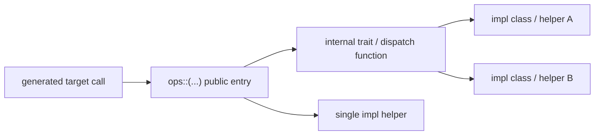

# TileFoundry Spec — Runtime

This spec owns the runtime contract outside the IR compile pipeline. It has
two surfaces:

- the Python-side `RuntimeModule` / launcher ABI used by `build(...)` and
  examples/tests
- the C++ runtime surface included by generated CUDA source

The C++ runtime is built on a vendored `cutlass/include/{cute,cutlass}`
snapshot.

## 1. Python Runtime Surface

### 1.1 `RuntimeModule`

An ir `Module` (the semantic definition — @func bodies the evaluator runs) and
a `RuntimeModule` (the runtime instance — kernel bodies) are twins: same
`name`, same child tree, same `entry`. `@runtime_module` / `@runtime_func`
(`tilefoundry.runtime.decorator`, below) build one twin mechanically from the
other, validated one-to-one at decoration time; the correspondence is
additionally held by comparing the two numerically ([§1.6](#16-check)), against bounds the
comparison's caller states — a `RuntimeModule` never runs the HIR evaluator.

```python
class RuntimeModule:
    name: str                                    # mirrors the ir Module node name
    entry: str | None                            # mirrors the ir Module entry (metadata)
    modules: tuple["RuntimeModule", ...]         # children, registered explicitly in __init__
    module: Module | None                        # the authored Module this stands for
    def __init__(self, name, entry=None, modules=()): ...
    def forward(self, *args): ...                # subclass-written orchestration — forward IS the step
    def __call__(self, *args): ...               # delegates to forward
    def load(self, resource): ...                # remember the source, recursive over children
```

- constraints:
  - the base class is authored like a `torch.nn.Module`: subclass it, build
    the child tree in `__init__` (children registered via `modules=`), write
    the composition in `forward`. Function bodies are `RuntimeFunction`
    attributes called from `forward`. `@runtime_module` (below) generates
    this subclass mechanically from a semantic `Module` and is the normal
    authoring path; a direct subclass remains available for special cases
    (e.g. `CompiledModule`, [§1.1.3](#113-internal-pipeline-compiled-origin)).
  - `load(resource)` (base class): recurses into each child with
    `resource.subtree(child.name)`; the base class itself resolves nothing.
    Weight prefixes follow module paths, matching ir attribute addressing.
    Lifecycle: construct (structure) → `load` (remember source) → call. A
    `RuntimeModule` does **not** run `prepare`; it loads straight from the
    directory the semantic side prepared ([§1.1.2](#112-weight-converter-and-prepare--forward)).
  - correspondence contract: the runtime twin's `forward` and the semantic
    evaluator's `evaluate(LoadedModule, ...)` must agree on the same inputs —
    `measure.check` comparing them against stated bounds ([§1.6](#16-check)) is that
    contract.
  - `module` names the authored `Module` a twin was generated from, so a
    caller holding an implementation can reach what it is judged against. A
    `RuntimeModule` that stands for no single authored Module — a compiled entry,
    a hand-written subclass — MUST report `None` rather than something chosen
    for it, and a caller that needs one MUST refuse instead of substituting.
  - `module` is therefore reserved on a twin. An authored `Module` MAY name a
    function, child or method `module`, and a generated twin binds each of those
    as an attribute, which would shadow the accessor. `@runtime_module` MUST
    reject such a Module when it is decorated, rather than generate a twin whose
    accessor answers something else.
  - the base class itself holds no weights or resource, and never runs the
    HIR evaluator.
  - two origins: compiled — `tilefoundry.build` / `compile` / `jit` →
    `LinkedModule` → the loader binds a `CompiledModule` (a `RuntimeModule`,
    not a `RuntimeFunction`) ([§1.1.3](#113-internal-pipeline-compiled-origin)); handwritten — a `@runtime_module`
    class (below), loading from a prepared checkpoint directory via a
    `RuntimeResource` ([§1.5](#15-runtimeresource)).

#### `@runtime_module` / `@runtime_func`

`@runtime_module(sem)` is a class decorator taking the semantic `Module`
instance; it returns a `RuntimeModule` subclass whose instances are *sem*'s
runtime twin — same function names, same child tree, same entry.
`@runtime_func` tags a plain method as a kernel body: same call signature as
the semantic `@func` of the same name, weight params included.

```python
# example
@runtime_module(attention_sem)
class Attention:
    @runtime_func                                    # weight params included, in the
    def mla_kv_update(self, hidden, gamma_kv, w_kv,  # semantic @func's own order
                      cos_pos, sin_pos, kv_cache0, cur_pos, s):
        ...  # a real kernel body, e.g. a torch / triton / CUDA implementation

    moe = SomeMoeRuntimeClass  # a @runtime_module class, not an instance
```

- constraints:
  - decoration-time validation is **strictly one-to-one**: the
    `@runtime_func` name set (a tagged method, or a `RuntimeFunction`
    instance class attribute — a heavy kernel that owns its own compilation
    state, standing in for a `@runtime_func`) MUST equal `sem`'s function
    name set, and the child-attribute name set MUST equal `sem`'s child
    module name set; missing *or* extra either MUST be rejected.
  - a child attribute is a `RuntimeModule` **subclass**, not an instance
    (typically another `@runtime_module` result); the generated `__init__`
    builds one instance per `sem.modules` entry via `child_cls(ir=<that
    child's ir Module>)`, so a child class MUST accept the `ir=` constructor
    keyword (every `@runtime_module` result already does).
  - weights are filled by name at call time from what `load` bound, so a
    kernel method's caller passes only activations.
  - orchestration methods (`forward` / `init_caches` / …) are reused from the
    semantic `Module.methods` verbatim and are never rewritten on the
    runtime side: inside them, `self.<fn>` / `self.<child>` resolve to the
    runtime twin's own kernels / children. Absent an own `forward`, the generated
    class runs `sem.methods["forward"]` if present, else calls the entry function
    by name. A loaded semantic Module resolves the same named functions,
    children, and methods ([§1.1.2](#112-weight-converter-and-prepare--forward)).

### 1.1.1 `RuntimeFunction`

`RuntimeFunction` is the **base class** for a node's function body; a body
subclasses it and overrides `__call__`. A handwritten torch / triton / CUDA
implementation takes whatever it needs (converted weights, caches) at
construction and returns its value(s) directly. `RuntimeFunction.type` is the
ABI contract below: an `EntryABI` built of `ParamABI` records.

```python
class ParamABI:
    name: str                       # parameter name
    type: TensorType                # dtype / shape / storage / layout all come from here

class EntryABI:
    name: str                       # entry / function name
    params: tuple[ParamABI, ...]    # ALL parameters (inputs + outputs), declaration order
    output_count: int = 0           # trailing count of output parameters

class RuntimeFunction:
    type: EntryABI                  # the ABI (entry_abi_of(ir_func))
    def __init__(self, type): ...
    def __call__(self, *acts): ...  # subclass overrides — launch, positional activations
```

- constraints:
  - the base `__call__` raises; every usable body is a subclass. Agents may
    write any subclass whose `__call__` runs (torch / triton / CUDA / …).
  - `ParamABI` reuses the IR type system instead of restating it: dtype /
    shape / storage / layout all come from `type` (a `TensorType`); a dynamic
    dim is whatever `type.shape` carries (e.g. a `DimVar`) — there is no
    separate dynamic-dim sentinel.
  - `EntryABI.params` lists ALL parameters (inputs + outputs) in declaration
    order; `output_count` is the trailing count of output parameters.
    `input_count` is `len(params) - output_count`; `input_params` /
    `output_params` are the corresponding leading / trailing slices of
    `params`.
  - `param_abi_of(var)` is the single `ParamABI`-derivation site, shared by
    codegen's host-entry ABI derivation (`codegen/cuda/emit.py`) and
    `entry_abi_of` below.
  - `entry_abi_of(fn)` derives an `EntryABI` for a HIR `Function`: one
    `ParamABI` per declared parameter, `output_count=0` (a value-returning
    implementation, not an out-param entry). The compiled-entry `EntryABI`
    (`output_count` possibly nonzero) is set by codegen from lowered IR
    instead ([codegen §4.3](./codegen.md#43-linkedmodule)).

### 1.1.2 Weight converter and `prepare` / `forward`

A weight's converter is registered **per weight**, not per module:
`@<compute_fn>.converter("<weight_name>")` decorates a throwaway `def` and
registers it on the base function's `converters`
([parser §3](./parser.md#3-implementation-overview)). Its parameters are
the raw-checkpoint names, annotated like any `@func` parameter; it returns
exactly the one declared `ConstTensor`'s shape / dtype. A weight needing no
transform has no converter. Two converters registered for the same weight
name is an error.

A converter is an HIR body like any other and MAY reach another node's function.

`load` and `prepare` are methods on the IR `Module` owned by
[core-ir §1](./core-ir.md#1-module). Execution of a loaded reading is entered
through `evaluator.evaluate`; this section defines that runtime-facing behavior
and the distinct loaded view:

```python
class LoadedModule:
    """Bind one reading of an IR Module to its resource."""

    module: Module
    resource: RuntimeResource
    modules: tuple["LoadedModule", ...]
```

`LoadedModule` is a frozen resource binding: it stores no tensors. Attribute
access resolves a function to another callable `LoadedModule` whose `entry`
names that function, a child to its child reading, and an orchestration method
with `types.MethodType`. Calling a loaded module enters `evaluate` once and
passes only activations; constants come from its resource at first use.

- constraints:
  - A reading covers its own Module's declared weights and holds one child
    reading per attached child ([core-ir §1](./core-ir.md#1-module)). A call is
    read in the reading of the Module owning the callee, so the parameters the
    call does not supply ([hir §1.1](./hir.md#11-function)) are filled by name
    from that Module's resource. Which reading applies follows the callee's
    owner and not the walk's depth, so every sub-evaluation of a body — a called
    body, one trip of a loop — is read in the reading its call resolved. One
    Module read twice yields two independent readings, and two attachments of one
    source Module do not borrow each other's resource.
  - `Module.prepare` (semantic side, offline, once): walk the tree; for each
    declared weight, fetch its converter's parameters from `raw` by their
    own (raw) names — a one-to-many alias is assembled here via
    `torch.stack` (`prepare`'s only reshaping) — run the converter through
    the evaluator, then strictly validate the result's shape and dtype
    against the weight's declared `ConstTensor` type. A weight with no
    converter is validated the same way against its raw (or stacked) value,
    unchanged. Output: one safetensors shard plus
    `model.safetensors.index.json`, keyed by clean, dot-joined module paths
    (e.g. `layer0.attention.w_kv`). Plain directory — no content-hash cache /
    manifest. The runtime twin never prepares; both twins `load` straight
    from the directory this writes.
  - `Module.load(resource)`: bind this node to `resource` and recurse into
    each child under `resource.subtree(child.name)`, returning a frozen
    `LoadedModule` tree. It MUST NOT write bindings onto the `Module`, which
    stays pure IR: one `Module` may be read any number of times — two
    checkpoints, two devices — and each reading is independent of the others.
    A child reached from two owners therefore yields one `LoadedModule` per
    owner rather than one binding the last owner wins. This is the semantic-side
    counterpart of the `RuntimeModule` twin's own `load` ([§1.1](#11-runtimemodule)).
  - The caller supplies `evaluate(..., device=...)`. Every activation and every
    weight used by the reading MUST already be on that device; a mismatch is
    rejected at the activation binding or weight's first-use point, naming the
    offending position or weight. Neither side moves tensors implicitly.
  - state is the caller's: a tensor that must survive across steps (e.g. a KV
    cache) is an ordinary `Tensor` param passed in and returned, and a step MUST
    NOT mutate one it was given. Sharding such a tensor is therefore the same
    mechanism as for any other — its own `TensorType.layout` — rather than a
    second description for an opaque state object.
  - The runtime twin's `forward` runs a registered `forward` orchestration
    method (`Module.methods`) when present, else its entry `@func`. A multi-node
    composition is chained by the caller, one `forward` per node.
    On the runtime twin, a bare step MUST be refused when neither a `forward`
    method nor an entry is present, naming the functions and methods to call
    instead of reporting `entry` as wrong.
    On the semantic side, `evaluate(loaded)` and `loaded(...)` run `entry` when
    one is declared; neither treats a `forward` method as an implicit default.
    A caller selects another HIR function or child through `loaded.<name>` and
    calls it, while a named orchestration method remains ordinary host Python.
  - Python entry into an HIR `Function` through the runtime twin's `forward`
    is the runtime event governed by [hir §1.1](./hir.md#11-function). A
    registered plain Python orchestration method stays on the host; every
    function it calls is a separate Python-to-HIR entry. An HIR-to-HIR `Call`
    remains inside the invocation and MUST NOT be surfaced as another runtime
    launch merely because its callee has a different Module owner.
  - a causal-LM root MAY define `init_caches`,
    `prepare_inputs_for_generation`, and `append_cache` orchestration methods.
    `prepare_inputs_for_generation(input_ids, step, caches, *, device)` receives
    a one-dimensional `torch.Tensor` of token IDs. The model selects the token
    at `step`, reshapes and places it, creates all other activation inputs in
    its own `forward` order, and returns that positional tuple. The caller owns
    the cache and expands only the token-ID tensor; it MUST NOT reconstruct a
    model's positional, rotary, scaling, or state inputs. It passes the active
    token-ID prefix as a view; a method MUST NOT mutate that view or retain it
    across steps. These methods bind on the runtime twin in the same way as
    `forward`.

### 1.1.3 Internal Pipeline (compiled origin)

```
Module (IR) → codegen: per-target LinkableModule… → LinkedModule (.so + metadata)
LinkedModule → load → CompiledModule (fully-loaded, public, callable RuntimeModule)
```

`LinkedModule` is a codegen product
([codegen §4.3](./codegen.md#43-linkedmodule)); the loader that turns it into a
`CompiledModule` is owned here. The loader and `LinkedModule` are not public
API; only `CompiledModule` (a `RuntimeModule`) is. `load_linked_module` returns
`CompiledModule(type=linked.entry, fn=entry_callable)`; `name` / `entry` are
both `linked.entry.name`. Its `forward` implements the out-param calling
convention directly ([§1.2](#12-calling-convention-compiledmodule)) — there is no separate function-body object it
delegates to. The compiled path has no `resource` / `weights` / `states`
(weights are ordinary entry arguments), so its `load` is the inherited no-op.

### 1.2 Calling Convention (`CompiledModule`)

`CompiledModule.forward(*args)` uses the out-param ABI (`type.output_count`
trailing params are outputs):

- **Auto-alloc**: `len(args) == type.input_count` — allocates output tensors
  from the first input's device/dtype, calls the entry, returns result(s).
- **Pre-alloc**: `len(args) == len(type.params)` — uses provided output tensors,
  returns same output(s). All outputs must be provided; partial → `TypeError`.
- **Return**: single output → bare tensor; multiple outputs → `tuple`.

Auto-alloc is torch-only; non-torch inputs raise `TypeError`. Output metadata
(dtype, shape) comes from `EntryABI.output_params` — each `ParamABI.type`
carries them (set by codegen from lowered IR, NOT guessed at runtime). This
convention is specific to `CompiledModule`; other `RuntimeModule.forward`
implementations are not bound by it.

### 1.3 `jit()` API

```python
def jit(
    fn_or_mod: Function | Module,
    /,
    *,
    target: Target | None = None,
    options: CompilerOptions | None = None,
    **kwargs,
) -> RuntimeModule:
    """Compile *fn_or_mod* and return the callable runtime module.

    Args:
        fn_or_mod: a hir.Function or Module (normalized to a Module).
        target: an explicit constructed Target, or the omitted-target policy.
        options: optional CompilerOptions.
        kwargs: rejected compatibility catch-all for unexpected keywords.

    Returns:
        The callable RuntimeModule.
    """
```

- constraints:
  - accepts only TileFoundry IR (`Function` / `Module`); raw Python functions
    raise `TypeError`; the full input contract is stated below.

`tilefoundry.jit(fn_or_mod, *, target=None, options=None)` is the JIT
entry point.  It accepts a `hir.Function` or `Module`, normalizes to a
`Module`, compiles with cache, and returns a callable `RuntimeModule`.

**Input contract**:
- Only TileFoundry IR objects (`Function` / `Module`) accepted.
- Raw Python functions raise `TypeError` — use `@func` first.
- A stated `target` MUST be a constructed Target instance. Strings
  MUST be refused and MUST NOT select a backend or construct a Target.
- A Module-owned Target takes precedence and is retained as the exact instance;
  a conflicting explicit Target or `CompilerOptions.target` MUST fail.
- Topology is declared by the `Module`; a single-function
  `@func(topologies=...)` declares it through the implicit `Module` that
  decorator yields ([parser §2.1](./parser.md#21-syntax)).
- Mesh layout is expressed in the DSL with lexical `with Mesh(...) as mesh` scopes.
- `jit()` has no `cta_mesh` / `thread_mesh` parameters.

**Pipeline**: `jit()` reuses [passes §6](./passes.md#6-top-level-api)'s
`lower()` → `build()` pipeline (`compile()`). It auto-wraps a bare `Function` input into a single-function
`Module` that declares no execution context.

**Cache**: in-process dict cache keyed by
`sha256(canonical_module_text + target_text + canonical_options_text)`.
`canonical_module_text` includes functions, the Module's *effective* topology
hierarchy, and `with Mesh` scopes. It uses the effective hierarchy rather than
the declared one so that a Module inheriting its hierarchy from an owner does
not collide with an identically-authored Module under a different owner. No
Python object identity and no
dedicated `cta_mesh` / `thread_mesh` key fields participate in the key.
`jit.cache_clear()` evicts; `jit.cache_info()` returns `{"size": N}`.

### 1.4 Launcher ABI

`tilefoundry.build(mod)` internally runs codegen and links the artifact (see
[codegen](./codegen.md)), then loads it and binds the entry; these are
implementation details. Users interact only with `RuntimeModule.__call__` /
`RuntimeFunction.__call__`.

Load contract:

- codegen produces the `LinkedModule` artifact
  ([codegen §4.3](./codegen.md#43-linkedmodule))
- loading uses `tvm_ffi.load_module(...)`
- entry binding uses the symbol named by `RuntimeModule.entry`
- callable arguments are DLPack-compatible tensors; `torch.Tensor` is one
  supported caller-side provider but is not the semantic contract itself

Generated host wrappers export entry symbols with TVM FFI:

```cpp
TVM_FFI_DLL_EXPORT_TYPED_FUNC(<entry_symbol>, <entry_function>);
```

The exported function accepts flattened input/output tensor arguments. HIR
functions may be written as `Function(params) -> tensor`, but by the runtime
boundary the TIR/codegen surface is explicit input/output parameters.

Launch geometry (grid / block extents) is embedded into the generated host entry
or supplied by an authored `launch(...)`; it is never carried as metadata past
codegen.

### 1.5 `RuntimeResource`

Checkpoint aliasing is a base capability of every resource, not a wrapper
class: both implementations below take an `alias={canonical: raw}` table,
resolved by the same lookup order.

```python
AliasValue = str | tuple[str, ...] | Absolute | Preprocessed

class Absolute:
    """Name a raw checkpoint key from the resource root.

    Attributes:
        name: attribute; Absolute raw key.
    """

    name: str


class Preprocessed:
    name: str | Absolute
    read: Callable[[torch.Tensor], torch.Tensor]

class RuntimeResource(Protocol):
    def load(self, name: str) -> torch.Tensor: ...
    def load_group(self, name: str) -> "tuple[torch.Tensor, ...] | None": ...
    def subtree(self, seg: str) -> "RuntimeResource": ...
```

- constraints:
  - `Preprocessed` is a frozen dataclass carrying one raw name and its one-tensor
    read transform.
  - `load(name)` returns the tensor for *name*; raises `KeyError` if absent,
    and MUST raise `TypeError` (naming `load_group`) if *name* resolves to a
    tuple-valued (one-to-many) alias.
  - `load_group(name)` returns the tuple of raw tensors for a one-to-many
    alias entry (e.g. per-expert weight shards, in declared order), or
    `None` when *name* has no tuple-valued alias — the ordinary, one-to-one
    case.
  - `subtree(seg)` returns a view scoped under one more path *segment*
    (`seg` is itself alias-resolved), so a child `RuntimeModule` addresses
    its own weights by their bare (unprefixed) name — `RuntimeModule.__init__`
    never sees a dotted name.
  - the resource resolves names and reads tensors. It MUST NOT stack, and it
    reshapes only where a `Preprocessed` alias entry states that the checkpoint
    stores that one tensor differently from how the Module declares it — a
    transpose, a slice of a fused tensor, or a dropped axis. Assembling a
    one-to-many group into one tensor stays `prepare`'s job ([§1.1.2](#112-weight-converter-and-prepare--forward)), via
    `torch.stack`, and so does any value that is a function of more than one raw
    tensor. `Preprocessed` MUST resolve to one name: a tuple-valued name is
    rejected at construction, naming the weight converter as the way to express
    it. Precision is not preprocessing: a read MUST return the checkpoint's own
    stored element type and be validated against the declaration ([§1.1.2](#112-weight-converter-and-prepare--forward)).

An `alias` entry renames one path *segment* or *leaf* **within the current
scope**, joined onto the caller's already-accumulated prefix: lookup order is
a path-qualified key (`f"{prefix}{name}"`) first, then a bare `name` entry,
then identity (`f"{prefix}{name}"` unchanged). A bare entry therefore serves
every instance at that level uniformly (e.g. `{"gamma_kv": "kv_norm.weight"}`
fires under every layer); a per-instance name (one real decoder layer, one
per-expert shard group) needs one literal entry per instance instead. A
`Preprocessed` value is a one-to-one leaf: `load` applies its `read` callable
to the raw tensor. A tuple value is the one-to-many group `load_group` reads;
`subtree`'s own segment resolution rejects a tuple-valued or `Preprocessed` hit
(a subtree segment MUST resolve to one relative path).

Aliasing therefore only ever reaches **downward**: a name resolved inside a
scope carries that scope's prefix, so a node cannot address a tensor its
parent owns — and a checkpoint may well store one there, such as a
layer-level norm weight a child consumes. `Absolute(name)` is the escape: an
alias whose value is `Absolute` MUST resolve to `name` as the whole raw key,
with no prefix joined onto it. It stays a leaf-only form — `load_group` reads
it as the one-to-one case and returns `None`, and `subtree` MUST reject it in
the same shape as a tuple-valued hit, because a subtree segment must resolve
to one relative name.

Three implementations:

```python
class DictResource:
    def __init__(
        self, data: Mapping[str, torch.Tensor], prefix: str = "",
        alias: "Mapping[str, AliasValue] | None" = None,
    ) -> None: ...

class SafetensorsResource:
    def __init__(
        self, ckpt_dir: str, prefix: str = "", device: str = "cuda",
        alias: "Mapping[str, AliasValue] | None" = None,
    ) -> None: ...

class DrawnResource:
    def __init__(
        self, module: Module, generator, device: str,
        drawn: "dict[str, torch.Tensor] | None" = None, prefix: str = "",
    ) -> None: ...

def draw_tensor(declared: TensorType, generator, device: str) -> torch.Tensor: ...
```

- constraints:
  - `DictResource` — in-memory / test double over a flat, dot-prefixed
    `{"layer0.w": tensor, ...}` mapping; `subtree` only extends the prefix
    each `load` / `load_group` name is joined onto, carrying `alias` down to
    every child view.
  - `SafetensorsResource` — reads a safetensors checkpoint directory; `load` /
    `load_group` open at most one shard handle per shard file (mmap'd via
    `safetensors.safe_open`, shared across `subtree` views) and read only the
    requested tensor(s), placed on *device*. Two directory shapes MUST be
    accepted: N shard files with a `model.safetensors.index.json` whose
    `weight_map` names the shard holding each key, and a single unsharded
    `model.safetensors` with no index, whose own key list is that map — a
    published checkpoint is only sharded once it outgrows the writer's limit,
    so requiring an index would refuse the small ones. A directory with
    neither MUST be reported as such rather than as a missing index.
    A raw key is cached weakly: repeated reads return the same tensor while a
    caller holds it, and the entry may disappear after the last reference is
    collected; scoped views share the index, shard handles, and tensor cache.
  - `DrawnResource` draws a declared weight lazily with `draw_tensor`, keeps
    the result strongly, and shares its generator and drawing ledger across
    `subtree` views without reseeding. The strong ledger is a contract: drawing
    the same name again would produce another random tensor, so the two sides
    of a comparison would no longer receive the same value. It has no alias
    groups, so `load_group` always returns `None`.
  - every read tensor keeps the element type the checkpoint stores. A
    declaration requiring a different precision uses a weight converter
    ([§1.1.2](#112-weight-converter-and-prepare--forward)), and `load` validates the converted or raw result against that
    declaration.

### 1.6 `check`

```python
class Predicate:
    """Carry one comparison and its bounds.

    Attributes:
        name: attribute; Registry and report name.
        bounds: attribute; Bound fields in surface order.
        needs_reference: attribute; Whether the comparison consumes a reference.
        discrete: attribute; Whether it is meaningful on integer outputs.
        guidance: attribute; One-line CLI guidance.
    """

    name: ClassVar[str] = ""
    bounds: ClassVar[tuple[str, ...]] = ()
    needs_reference: ClassVar[bool] = True
    discrete: ClassVar[bool] = True
    guidance: ClassVar[str] = ""

PREDICATES: Mapping[str, type[Predicate]]

class PredicateResult:
    """Record one predicate measurement.

    Attributes:
        predicate: attribute; Predicate that ran.
        values: attribute; Named measurements.
        passed: attribute; Whether its bound held.
        note: attribute; Optional interpretation note.
    """

    predicate: Predicate
    values: Mapping[str, float]
    passed: bool
    note: str | None = None

class OutputCheck:
    """Record predicate results for one output.

    Attributes:
        path: attribute; Structural output path.
        shape: attribute; Runtime output shape.
        dtype: attribute; Runtime output dtype.
        ref_norm: attribute; Reference norm when a reference exists.
        results: attribute; Predicate results.
        passed: attribute; Derived read-only verdict over the results.
    """

    path: str
    shape: tuple[int, ...]
    dtype: str
    ref_norm: float | None
    results: tuple[PredicateResult, ...]

    def passed(self) -> bool: ...

class Report:
    """Record all checked outputs.

    Attributes:
        outputs: attribute; Output checks in structural order.
        passed: attribute; Derived read-only verdict over the outputs.
    """

    outputs: tuple[OutputCheck, ...]

    def passed(self) -> bool: ...

def check(candidate: Callable, reference: Callable | None, inputs: tuple, *,
          expect: Mapping[str, Sequence[Predicate]]) -> Report: ...
```

- constraints:
  - `PREDICATES` MUST contain the built-in `allclose`, `rel_l2`, `cosine`,
    `equal`, `ulp`, `max_abs`, `max_rel`, and `nan_inf` predicates by name.
  - `check` runs `candidate(*inputs)`, and `reference(*inputs)` when there is a
    reference, and measures each output against the predicates *expect* states
    for it. Neither *reference* nor *expect* has a default.
  - an input MAY be a bare tensor or an arbitrarily nested tuple of tensors. Every
    leaf MUST be a tensor.
  - a result MAY be a bare tensor or an arbitrarily nested tuple of tensors
    (e.g. `forward`'s `(logits, past_key_values)`). `check` flattens both
    results and MUST reject a candidate whose flattened structure, shape or
    dtype differs from the reference's.
  - every produced tensor MUST have exactly one non-empty list of predicates,
    and a path *expect* names that was not produced MUST be rejected. A result
    that flattens to nothing MUST be an error rather than a pass.
  - `reference=None` admits only predicates whose `needs_reference` is false; any
    other MUST be rejected. `ref_norm` is then absent, having nothing to measure.
  - a predicate whose `discrete` is false MUST be rejected on an integer or
    boolean output, naming exact comparison instead.
  - where a measure has no meaning at the values it was given — a relative
    distance against a zero reference, a direction between two zero vectors — the
    result MUST state what was measured instead through its `note`, rather than
    return a number whose scale is an artefact of a clamp.
  - `OutputCheck.passed` and `Report.passed` are read-only properties derived
    as `all` of their parts; neither is accepted as a constructor field, so a
    verdict cannot disagree with the measurements printed beside it.
  - it is not specific to `RuntimeModule`: *candidate* / *reference* may be a
    `RuntimeModule` bound method, a raw torch callable, or an evaluator
    closure — anything callable on *inputs*.

## 2. C++ Runtime Surface

Generated CUDA source includes the umbrella runtime header:

```cpp
#include <tilefoundry/runtime.h>
```

`runtime.h` selects the target-specific runtime by a build-injected target
macro (exactly one of `TILEFOUNDRY_TARGET_CUDA` / `TILEFOUNDRY_TARGET_CPU`). The CUDA
runtime surface — topology, mesh, sharding, storage, and op declarations — lives
under `tilefoundry/runtime/cuda/runtime.cuh` (the CPU surface under
`tilefoundry/runtime/cpu/runtime.h`); the include tree is target-first
(`runtime/<target>/…`), no intermediate `target/` segment. Generated code MUST
include only the umbrella header and MUST NOT include target subheaders directly.

`runtime.cuh` also re-exports the CuTe primitives generated code is written in
terms of — `cute::copy`, `cute::make_tensor` and the layout algebra behind
`cute::Tensor` ([§2.9](#29-tensor-and-storage)) — so a generated translation
unit needs no `cute/` include of its own. A re-exported primitive keeps CuTe's
own contract, which this document does not restate: that `cute::copy` requires
`size(src) == size(dst)` and compatible element types is CuTe's requirement and
not one the runtime adds. **A CuTe primitive is not a runtime op** and is not in
[§3](#3-runtime-ops)'s list; where an op is one of them with the operands
resolved to this instance's slice first, that op's own entry says so —
`ops::copy` ([§3.3](#33-tilefoundryopscopy-tile-copy)) is `cute::copy` read that
way.

### 2.1 `TopologyScope`

```cpp
/**
 * @brief A fixed enumeration of program topology levels.
 */
enum class TopologyScope {
  cta,          ///< maps to blockIdx
  warp,         ///< a warp of the block; named here, not queryable (below)
  thread,       ///< maps to threadIdx
  scope_count,  ///< a sentinel
};
```

- constraints:
  - The enumeration is fixed. A level being named here does not make it a
    program topology level a mesh may bind: codegen admits `cta` and `thread`
    ([target](./target.md)), and `program_id<warp>()` has no specialization, so
    a warp-scoped mesh fails to link rather than reading a wrong id. Warp-sized
    groupings live as an axis of a `thread` mesh's layout.

### 2.2 Topology Metadata

```cpp
/**
 * @brief Shape of topology level T (e.g. program_shape<cta>() → grid dims).
 * @tparam T the topology level
 */
template <TopologyScope T> auto program_shape() noexcept;

/**
 * @brief Size of topology level T, as `cute::size(program_shape<T>())`.
 * @tparam T the topology level
 */
template <TopologyScope T> constexpr auto program_dim() noexcept;

/**
 * @brief Linearized scalar runtime id of T (current execution instance).
 * @tparam T the topology level
 */
template <TopologyScope T> size_t program_id() noexcept;
```

- constraints:
  - static vs dynamic (launch-provided CTA) behavior and the emission rule are
    stated below.

For a static topology level, `program_shape<T>()` and `program_dim<T>()` are
compile-time constants. For a launch-provided (dynamic) CTA count, no constexpr
`program_shape<cta>` is emitted and `program_dim<cta>()` resolves to the
launch-provided grid extent at runtime; the emission rule is owned by
[target](./target.md). `program_id<T>()` is
always a runtime query returning the current execution instance id.

### 2.3 `tilefoundry::Mesh`

```cpp
/**
 * @brief Which level of the launch a mesh spreads over. Nothing else.
 * @tparam Scope the program topology level
 */
template <TopologyScope Scope>
struct Topology {
  static constexpr TopologyScope scope = Scope;  ///< the level, and no extent beside it
};

/**
 * @brief A device mesh: one topology level bound to a CuTe mesh layout.
 * @tparam TTopo a `Topology<Scope>`
 * @tparam TMeshLayout a `cute::Layout`, or a `cute::ComposedLayout` for a slice
 */
template <class TTopo, class TMeshLayout>
struct Mesh {
  using topology = TTopo;      ///< the level, as a type
  using layout = TMeshLayout;  ///< the positions, as a type
  TMeshLayout layout_value;    ///< the positions, as a value
};

/**
 * @brief The first instance a mesh layout covers, in the level's own numbering.
 * @tparam TMeshLayout the mesh layout
 */
template <class TMeshLayout>
constexpr int mesh_offset();

/**
 * @brief A mesh layout's positions, with its offset taken off.
 * @param layout the mesh layout
 */
template <class L>
constexpr auto mesh_positions(L const& layout);

/**
 * @brief A mesh over `extents`, row-major, starting at instance zero.
 * @tparam Scope the program topology level
 * @param extents the per-axis position counts
 */
template <TopologyScope Scope, class Extents>
constexpr auto make_mesh(Extents const& extents);
```

- constraints:
  - `Mesh` carries a level and a layout, the same two the IR `Mesh` has beside
    its axis names ([shard §5](./shard.md#5-mesh)). It is an aggregate, so a
    second statement of the same fact is a second place for it to be wrong:
    how many instances a mesh has is `cute::size(Mesh::layout)` and how they
    are shaped is `cute::shape(...)`. `Topology` states no extent, and `Mesh`
    no base.
  - One level per mesh. An IR mesh naming several levels lowers to the first;
    finer groupings (a warp of a block) are an axis of the layout, not a second
    `Topology`.
  - The stride order of `make_mesh` is what turns a linear instance id into a
    coordinate: extents `(8, 32)` row-major give `(id / 32, id % 32)`, so a
    thread mesh names its warps first and its lanes last.
  - No `local_index()`. A mesh coordinate is derived where it is used, from the
    instance id the level reports: `mesh_positions(layout_value)
    .get_hier_coord(program_id<topology::scope>() - mesh_offset<layout>())`
    ([§2.10.1](#2101-inputs)). A mesh holds no runtime state of its own.

A narrowed mesh — threads 64..127 of a 128-thread block — is not a third field.
The IR spells the slice `ComposedLayout(inner, offset, outer)`, a layout mapping
a coordinate to `offset + outer(c)` ([shard §4](./shard.md#4-composedlayout)),
and the C++ mesh mirrors it with the CuTe type of the same name, whose
`operator()` is literally `layout_a()(offset() + layout_b()(c))`:

```cpp
// example: threads 64..127 of a 128-thread block, as (2 warps, 32 lanes)
Mesh<Topology<TopologyScope::thread>,
     cute::ComposedLayout<cute::identity, cute::Int<64>,
                          cute::Layout<cute::Shape<cute::Int<2>, cute::Int<32>>,
                                       cute::Stride<cute::Int<32>, cute::Int<1>>>>>
```

- constraints:
  - Only this shape of `cute::ComposedLayout` is a mesh: `cute::identity` over a
    static offset. A swizzle in the first slot, or a dynamic offset, is a mesh
    whose first instance is not a compile-time number, and every reader wants it
    as one.
  - `mesh_offset<L>()` is that offset, or `0` for a plain layout;
    `mesh_positions(l)` is `layout_b()` for a composed layout and `l` itself
    otherwise, so one spelling serves both at every call site.
  - The offset MUST NOT be dropped. `mesh_positions` maps a coordinate to an
    instance *within* the mesh; only the offset turns that into an instance of
    the launch. Reading a coordinate off a raw instance id instead hands every
    instance of a slice the box its neighbour owns.
  - A plain `cute::Layout` is the whole launch level at offset zero — the case
    every mesh was before slices existed — and `cute::size` of either is the
    participant count, since a composed layout's size is `layout_b()`'s.

### 2.4 `tilefoundry::ShardLayout`

```cpp
/**
 * @brief A layout, its per-axis shard attributes, and the mesh they run over.
 * @tparam TLayout the underlying CuTe layout
 * @tparam TAttrs shard attributes, ordered by mesh axis
 * @tparam TMesh the bound device domain
 */
template <class TLayout, class TAttrs, class TMesh>
struct ShardLayout {
  using layout = TLayout;    ///< the layout, as a type
  using attrs = TAttrs;      ///< the attributes; a type only, they carry no state
  using mesh = TMesh;        ///< the mesh, as a type
  TLayout layout_value;      ///< the layout, as a value (dynamic extents are real)
  TMesh mesh_value;          ///< the mesh, as a value
};

/**
 * @brief Package a layout, a mesh, and attributes without reinterpreting them.
 * @param layout a CuTe layout, or a shape whose strides come out row-major
 * @param mesh the bound device domain
 */
template <class TLayout, class TMesh, class Attrs>
constexpr auto make_shard_layout(TLayout const& layout, TMesh const& mesh, Attrs const&);
```

- constraints:
  - `TAttrs` is a `cute::tuple` of empty tags ([§2.5](#25-tilefoundryshard--shard-attributes)),
    so the aggregate holds no attribute value; the attributes are read off the
    type. Every extent and stride that is not a compile-time fact lives in
    `layout_value` / `mesh_value`.
  - `make_shard_layout` is to `ShardLayout` what `cute::make_layout` is to
    `cute::Layout`: the axes are the caller's and the attributes point at them
    as written. It does not refactor the shape
    ([shard §7.1.1](./shard.md#711-layoutshape) states that factorisation).

### 2.5 `tilefoundry::shard` — Shard Attributes

```cpp
namespace tilefoundry::shard {
  template <int Axis> struct S {};         // Split along axis
  struct B {};                             // Broadcast (replicate)
  template <class Reduction> struct P {};  // Partial reduction
  struct Dynamic {};                       // Dynamic / data-dependent
}
```

- constraints: none

Shorthand: `S<Axis>` = Split, `B` = Broadcast, `P<Reduction>` = Partial.

### 2.6 `tilefoundry::ShardTensor`

```cpp
/**
 * @brief A CuTe tensor/view paired with its runtime shard layout.
 */
template <class TEngine, class TGlobalLayout, class TShardLayout>
struct ShardTensor {
  using engine_type = TEngine;
  using global_layout_type = TGlobalLayout;
  using shard_layout_type = TShardLayout;
  TEngine engine;              ///< CuTe tensor/view (gmem/smem/rmem); raw pointer rejected
  TShardLayout shard_layout;   ///< runtime shard-layout value (dynamic dims carry real extents)
  auto data();                 ///< underlying pointer of the wrapped cute tensor
  auto data() const;
};
```

- constraints:
  - `engine` must be a full cute tensor/view, never a raw pointer (residency
    lives on the engine type); `data()` drops the residency tag. The full
    residency / raw-pointer rules are stated below.

`engine` holds the **full cute tensor/view, not a raw pointer**. The
gmem / smem / rmem **residency category** lives on the cute engine *type*;
a raw `T*` loses it (cute mis-classifies a bare pointer as `rmem` even for
a gmem tensor), which would break residency-aware projection in `local()`
and residency dispatch in `copy()`. `make_shard_tensor` therefore rejects
raw pointers at compile time.

`data()` mirrors `cute::Tensor::data()` so a `ShardTensor` and a plain cute
tensor can be accessed uniformly. Because it returns a raw pointer, it
**drops the residency tag** and MUST only be used where residency no longer
matters (e.g. the per-thread MMA register fragment); residency-aware paths
use `local()` instead.

### 2.7 `tilefoundry::make_shard_tensor`

```cpp
/**
 * @brief Factory: bind a global layout and a shard layout onto a CuTe tensor.
 * @param tensor a CuTe tensor / view (raw pointers rejected at compile time)
 * @param global_layout the global layout to bind
 * @param shard_layout the shard layout to bind
 */
template <class T, class GL, class SL>
auto make_shard_tensor(T const& tensor, GL global_layout, SL shard_layout)
  -> ShardTensor<T, GL, SL>;
```

- constraints:
  - Factory. `T` must be a CuTe tensor/view; raw pointers rejected at compile time.

### 2.8 `tilefoundry::copy` — Shard-aware Overloads

```cpp
/**
 * @brief Copy the full tensor, shard → plain.
 * @param src the shard-tensor source
 * @param dst the plain destination tensor
 */
template <class T, class GL, class SL, class DT>
void copy(ShardTensor<T, GL, SL> const& src, DT& dst);

/**
 * @brief Copy the full tensor, plain → shard.
 * @param src the plain source tensor
 * @param dst the shard-tensor destination
 */
template <class ST, class T, class GL, class SL>
void copy(ST const& src, ShardTensor<T, GL, SL>& dst);

/**
 * @brief Copy this instance's slice, shard → shard.
 * @param src the shard-tensor source
 * @param dst the shard-tensor destination
 */
template <class TS, class GLS, class SLS, class TD, class GLD, class SLD>
void copy(ShardTensor<TS, GLS, SLS> const& src, ShardTensor<TD, GLD, SLD>& dst);

/**
 * @brief Copy the full tensor, plain → plain.
 * @param src the source tensor
 * @param dst the destination tensor
 */
template <class ST, class DT>
void copy(ST const& src, DT& dst);
```

- constraints:
  - Each overload copies what `local()` ([§2.10](#210-local)) leaves this
    execution instance, so a copy the mesh splits across threads is a
    thread-scoped shard layout rather than a strided loop at the call site.
  - **The move width is a property of the layouts, not of the call.** It is the
    largest power of two both operands run contiguously over —
    `max_common_vector` of the two *projected* layouts, which
    [§2.10.2](#2102-computation) derives statically from the shard layout and
    the mesh — capped so neither side's move exceeds 16 bytes.
  - A dtype change does not force the width to one element: the wide load still
    holds and the conversion happens on the way out. The cap follows the wider
    of the two element types.
  - Register fragments take the element path. Addressing `&frag(i)` under a loop
    the compiler cannot unroll spills the fragment to local memory, which costs
    more than the wider move saves.
  - Where the shard's offset lands is the one thing a layout cannot state, so
    the implementation tests the two base pointers against the width's alignment
    and falls back to the element path when it does not hold. That is one
    comparison, not a scan.

### 2.10 `local()`

```cpp
/**
 * @brief Project t to this execution instance's local view.
 * @param t the shard tensor to project
 */
template <class E, class GL, class SL>
auto local(ShardTensor<E, GL, SL> const& t) noexcept;
```

- constraints:
  - Returns the cute `Tensor` view this execution instance owns on `t`.

#### 2.10.1 Inputs

Let `t: ShardTensor`, `sl = t.shard_layout`, `S = sl.layout_value`'s
strides, `A = SL::attrs`, and `coord` the mesh coordinate of this instance:
`mesh_positions(sl.mesh_value.layout_value).get_hier_coord(id - offset)` for
`id = program_id<scope>()` and `offset = mesh_offset<mesh::layout>()`
([§2.3](#23-tilefoundrymesh)). Subtracting the offset is what makes a slice's
first instance its own coordinate zero.

- `t.engine` is the per-instance cute tensor / view; `t.engine.data()`
  is the base ptr the current instance already holds.
- `sl.layout.shape` is the canonical layout shape
  ([shard §7.1.1](./shard.md#711-layoutshape)).
- `S` is storage-physical
  ([shard §7.1.2](./shard.md#712-layoutstrides)).

#### 2.10.2 Computation

    offset = Σ_{m : A[m] = Split(k)}  coord[m] · S[k]
    ptr    = t.engine.data() + offset
    shape' = shard_layout_local_shape(sl)
    return cute::make_tensor(ptr, Layout(shape', S))

- `A[m] ∈ {Broadcast, Partial}` contributes `0` to `offset`.
- `A[m] = Dynamic` MUST have been resolved before `local()`; otherwise
  the call is ill-formed.

#### 2.10.3 Single path across storages

For every `A[m] = Split(k)`, by [shard §7.1.2](./shard.md#712-layoutstrides):

    S[k] = 0  ⇒  contribution = 0
    S[k] > 0  ⇒  contribution = coord[m] · S[k]

The formula is therefore one path across gmem / smem / rmem; no
storage-specific branching is required.

### 2.9 Tensor And Storage

```cpp
/**
 * @brief A CuTe tensor: an engine plus a layout.
 * @tparam Engine the CuTe engine / iterator / pointer category
 * @tparam Layout a CuTe layout or tilefoundry::ShardLayout
 */
template <class Engine, class Layout>
class cute::Tensor;
```

- constraints:
  - when `Layout` is `ShardLayout`, the tensor has distributed semantics

| storage | C++ |
|---------|-----|
| `"gmem"` | `T*` / `cute::gmem_ptr<T>` |
| `"smem"` | `cute::smem_ptr<T>` |
| `"rmem"` | register-resident engine |

## 3. Runtime Ops

Codegen targets one public namespace function per runtime op/family:

```cpp
tilefoundry::ops::<op>(...)   // one public namespace function per runtime op / family
```



**What is an op.** An op's behaviour is derivable from the layout system's
description of its arguments: its operands are `ShardTensor`s or a `Mesh`, and
its tier is read off their layouts. That admits exactly seven entries, and
`ops::` holds these and nothing else:

| entry | operands the geometry comes from |
| --- | --- |
| `elementwise` ([§3.8](#38-tilefoundryopselementwise-pointwise)) | the destination's local domain, and a stride-0 mode wherever a source broadcasts |
| `copy` ([§3.3](#33-tilefoundryopscopy-tile-copy)) / `copy_async` ([§3.4](#34-tilefoundryopscopy_async-async-gmemsmem-staging)) | both operands' shard layouts: shape, strides, share and move width |
| `reduce` ([§3.2](#32-tilefoundryopsreduce-reduction-family)) | the axes the destination broadcasts that the source splits |
| `dot` ([§3.7](#37-tilefoundryopsdot-fused-multiply-contract)) | the axes the operands' meshes contract |
| `mma` ([§3.6](#36-tilefoundryopsmma-matrix-multiply-accumulate)) | rank-2 static layouts are a tile; the warp count is the accumulator's mesh |
| `sync` ([§3.1](#31-tilefoundryopssync-mesh-scoped-barrier)) | the mesh's scope, base and count |
| `tma_copy` ([§3.5](#35-tilefoundryopstma_copy-barrier-completing-gmemsmem-staging)) | both shard layouts, asserted: one contiguous run each, whole tiles, matching element types |

Anything that takes a raw pointer, an `int` or a type and answers a question
about it is not an op but a utility, and belongs outside `ops::` — the
warp-scoped primitives of [§4](#4-warp-primitives) and the `mbarrier`
instructions a caller writes around `tma_copy` are both that. In particular the
runtime publishes **no predicate and no constant reporting which tier an op
selected or how wide a move it chose**: a caller cannot use one to decide how to
build its operands, since the answer is a function of the operand types it would
already have had to build, and putting the tier behind one entry was the point.

**Runtime-owned dispatch.** Where an op has more than one implementation tier
(selected by scope or by operand layout), the runtime exposes exactly **one**
public entry — never one op per tier. The active tier is derived at **compile
time** from the operand `ShardLayout`s, together with any codegen-static geometry
passed as template parameters, through a template trait, and is selected inside
the entry (`if constexpr`). Codegen emits one uniform call per op and never
selects a tier, computes a per-tier parameter, or carries the selection on the
TIR op. `ops::reduce` ([§3.2](#32-tilefoundryopsreduce-reduction-family))
derives its reduction level from the operand shard layouts and `ops::sync`
([§3.1](#31-tilefoundryopssync-mesh-scoped-barrier)) derives its participant
predicate from the barrier geometry; both are instances of this principle. A
target runtime implementation MAY select an internal optimized load/store path
(such as a wider vector copy) behind this single entry without changing the
public entry or its observable result. The codegen side is
[codegen §3](./codegen.md#3-runtime-owned-op-dispatch).

**One pointwise op.** Every elementwise operation — fill, cast, clamp, `relu`,
add, multiply, and every broadcast shape of those — is the single entry
`ops::elementwise` ([§3.8](#38-tilefoundryopselementwise-pointwise)). Arity
is the length of its source pack, the operation is the callable it takes, and a
broadcast operand is a stride-0 mode on that operand's layout. None of those
three is a name: there is no `ops::fill`, `ops::cast`, `ops::unary`,
`ops::binary`, or `ops::binary_bcast_*`, and adding one would be re-encoding in
a symbol what an argument already states.

**Annotation convention.** `ops::*` public entries, their internal impl
functors, and op tags MUST be annotated `__device__` (their bodies are
device-only). `CUTE_HOST_DEVICE` MUST be reserved for tensor-view / layout
helpers genuinely capable of host compilation (e.g. `local()`,
`make_shard_tensor`, `tilefoundry::copy`).

### 3.1 `tilefoundry::ops::sync` (mesh-scoped barrier)

```cpp
/**
 * @brief Barrier over every instance of a mesh.
 * @param mesh the participants; its scope and layout pick the barrier
 */
template <class TTopo, class TLayout>
__device__ void sync(Mesh<TTopo, TLayout> const& mesh);

/** @param bar the module's two-word grid-barrier counter pair, or nullptr */
template <class TTopo, class TLayout>
__device__ void sync(Mesh<TTopo, TLayout> const& mesh, unsigned int* bar);

/** @param id one of the fifteen named hardware barriers, 1..15 */
template <class TTopo, class TLayout, int Id>
__device__ void sync(Mesh<TTopo, TLayout> const& mesh, BarrierId<Id> id);
```

- constraints:
  - Which barrier runs is the mesh's own answer and never a call-site template
    argument: the topology scope says the level, and the mesh layout says both
    how many instances (`size(layout)`) and which instance the run starts at
    (its offset — a sliced mesh is a `cute::ComposedLayout` mapping a coordinate
    to `offset + outer(c)`, ([§2.3](#23-tilefoundrymesh))).
  - The classification MUST agree case for case with `classify` in
    `ir/tir/sync.py`: an un-sliced `cta` mesh takes the grid barrier; a mesh
    covering the whole block takes the warp's convergence when the block is one
    warp wide and the block barrier otherwise; a mesh fitting inside one warp
    takes the warp's convergence; a warp-aligned run covering part of the block
    takes a named barrier.
  - Two meshes name no barrier and are rejected at the call site: a sliced `cta`
    mesh (the CTAs outside it never arrive) and a cross-warp run whose base or
    count is not a multiple of 32 (part of a warp would be inside the barrier
    and part outside). Both are deadlocks, not slow paths.
  - The runtime states which tier needs which resource and allocates none. A
    caller that supplies none where one is needed MUST fail to compile with a
    message naming the resource; a caller that supplies the wrong one MUST fail
    the same way. A grid counter is a fact about the launch and a free named
    barrier a fact about the whole kernel; neither is knowable from one mesh.
  - A named barrier id MUST be a compile-time value in `1..15`. Id `0` is the
    one `__syncthreads` arrives at and MUST be rejected: `bar.sync` counts
    arrivals per id, so a subset posted to it releases a whole-block barrier
    early. An id MUST NOT be derived from the mesh — two meshes sharing a base
    and differing in count would collide.
  - Codegen emits only `sync`; it does not call lower-level barrier helpers.
  - Grid barriers require every CTA of the launch to be co-resident and to
    execute the barrier.
  - A grid barrier's counter pair is zero-initialized before first use and is
    owned by the generated module. Whether one exists is a fact about the
    launch, so the caller passes it; with none, a cooperative launch's grid
    group is used instead.

### 3.2 `tilefoundry::ops::reduce` (reduction family)

```cpp
/**
 * @brief Reduce src into dst along Axes.
 * @tparam Op compile-time combine tag (add_op, mean_op, max_op, min_op, absmax_op)
 * @tparam Axes compile-time reduced logical axes
 * @param src source operand; sharded operands carry ShardLayout
 * @param dst destination operand; sharded operands carry ShardLayout
 * @param ws shared-memory workspace, one slot per warp; required exactly when the layouts cross warps
 */
template <class Op, class Axes, class Src, class Dst, class Ws = reduce_impl::no_workspace_t>
__device__ void reduce(Src const& src, Dst& dst, Ws&& ws = {});
```

- constraints:
  - `reduce` is the only public runtime reduce entry; tier names and helper
    functions are internal.
  - Sharded operands derive the active tier and warp grouping from `(src, dst)`
    shard layouts inside the runtime. `ws` is a *resource the layouts demand*
    and never the tier selector: a reduce mesh that stays inside one warp takes
    the intra-warp tier and needs no workspace, and one that crosses warps does
    not compile without one.
  - Both operands name one mesh and give one attr per mesh axis; the reduced
    set is `src[i]` split or partial against `dst[i]` broadcast.
  - The combine domain is `float` — `init`, `elem`, `combine` and `finalize`
    all are — so an element type `float` cannot hold exactly (a 4- or 8-byte
    integer, a packed key) is refused at the entry rather than rounded.
  - Plain operands derive extents from the operand rank and size inside the
    runtime.
  - A reduction whose reduced axis crosses CTA boundaries is not supported.

### 3.3 `tilefoundry::ops::copy` (tile copy)

The op-surface spelling of `tilefoundry::copy` ([§2.8](#28-tilefoundrycopy--shard-aware-overloads)):
one entry, taking tensors, with the transfer shape, the strides, the element
types, the share this instance owns and the move width all read off the operand
`ShardLayout`s.

```cpp
/**
 * @brief Copy src into dst, at the width their shard layouts admit.
 * @param src the source tile
 * @param dst the destination tile
 */
template <class TSrc, class TDst>
__device__ void copy(TSrc const& src, TDst& dst);
```

- constraints:
  - The width rule, the dtype-change rule, the register-fragment rule and the
    alignment fallback are [§2.8](#28-tilefoundrycopy--shard-aware-overloads)'s
    and are not restated here.
  - The call site names no vector width and no thread index. A copy split across
    a block's threads is a thread-scoped mesh in the operands' shard layouts;
    the entry then copies exactly the slice `local()` hands each thread.

### 3.4 `tilefoundry::ops::copy_async` (async gmem→smem staging)

```cpp
/**
 * @brief Async staging copy; fast path stages a gmem source into an smem destination.
 * @param src per-thread projected source operand
 * @param dst per-thread projected destination operand
 */
template <class TSrc, class TDst>
__device__ void copy_async(TSrc const& src, TDst& dst);
```

- constraints:
  - The call is non-blocking; generated code orders later reads through
    `cp_async_commit` and `cp_async_wait`.
  - The name is the contract: a pair of projected views `cp.async` cannot move
    a 4-byte-or-wider word of does not compile, and takes `ops::copy`
    ([§3.3](#33-tilefoundryopscopy-tile-copy)) instead. There is no synchronous
    tier hiding under this entry for the caller to wait on.
  - The two projected slices hold the same number of elements. Where an
    instance owns part of a wider destination, that is the destination's shard
    layout to state; the source's offset is not borrowed for it.
  - Runtime implementation details such as vector width and tail handling live
    in code comments, not this spec entry.

### 3.5 `tilefoundry::ops::tma_copy` (barrier-completing gmem→smem staging)

Stage a tile into shared memory and signal an mbarrier when it is readable. It
is not a tier of `ops::copy_async`
([§3.4](#34-tilefoundryopscopy_async-async-gmemsmem-staging)): there every
thread issues its own load and a commit closes the group, so the thread that
issues is the thread that waits; here completion lands on a barrier, which is
what lets a consumer wait for a tile it did not fetch.

```cpp
/**
 * @brief Stage src into dst, completing on bar.
 * @param src the source tile
 * @param dst the shared destination tile
 * @param bar the mbarrier the completion lands on
 */
template <class Src, class Dst>
__device__ void tma_copy(Src const& src, Dst& dst, uint64_t* bar);
```

- constraints:
  - The operands are tensors, not addresses: the entry takes the transfer shape,
    the strides and the element type from the operand `ShardLayout`s. A caller
    passing a pointer and a byte count would be choosing the tier itself, which
    is what [§3](#3-runtime-ops) puts behind one entry.
  - **One instruction, and a run-time hand-off.** `cp.async.bulk` moves the run:
    one elected thread issues it, nothing blocks, and it is still in flight at
    the next statement. A byte count off the 16-byte grain hands off to the
    element path at run time, every thread in the block taking part. Which one
    runs is not a compile-time choice: the operands must satisfy the
    preconditions below, and a layout that fails them is refused, not routed
    elsewhere. It was a static tier once, selected on whether either operand
    coalesces to one run — but a layout that fails that test is exactly a layout
    the element path addresses wrongly, so the failing branch computed a wrong
    answer instead of rejecting the call.
  - Both paths leave `bar` completing when the data is readable, and both are
    safe to call from every thread in the block. Consumers wait on the phase and
    never learn which ran.
  - constraints on the operands, each a `static_assert`: every mesh axis leaves
    both tiles whole (neither is split across instances); the destination is a
    `ShardTensor` (the element path needs its mesh for the instance count and
    the barrier); both projections are one contiguous run; the element types
    match, since bytes move unconverted; and the two slices are the same size,
    because the count is read off the source and written at the destination's
    origin.
  - `bar` is a resource parameter, the way `ops::reduce`'s `ws` is: a 64-bit
    shared-memory word, not a sharded tensor, so it carries no `ShardLayout` and
    there is nothing for a tier to read off it. Arming that word, testing its
    phase and releasing it are single `mbarrier.*` instructions which read
    nothing off a layout either, so they are **not ops** and the runtime
    publishes no entries for them; a caller writes them where it builds the
    ring. The phase parity alternates `0, 1, 0, ...` across successive
    completions, which is what lets a fixed ring of barriers serve a stream of
    any length: stage `t` of a ring of `n` waits on parity `(t / n) & 1`.
  - The bulk tier's arrival declares the byte count on the instruction that
    issues the copy, so the declared and delivered counts are one expression and
    cannot drift; the caller does not arrive separately.
  - The transfer must be a whole number of 16-byte grains for the instruction to
    have defined behaviour. The extent is what the shard leaves behind, not a
    property of the layout type, so an off-grain extent is a run-time hand-off
    to the element path inside the same entry — same barrier, same result.

### 3.6 `tilefoundry::ops::mma` (matrix multiply-accumulate)

`c += a @ b`, one entry, with the tier read off the operand layouts: rank-2
static shard layouts on `a` and `b` are a tile and the entry loops the atom over
it; anything else is a lane's already-gathered fragment and takes the single
instruction. Codegen emits this one call either way.

```cpp
/**
 * @brief c += a @ b, over a tile or over one lane's fragments.
 * @param a the left operand, (M, K) for a tile
 * @param b the right operand, (N, K) for a tile
 * @param c the accumulator
 */
template <class TA, class TB, class TC>
__device__ void mma(TA const& a, TB const& b, TC& c);
```

- constraints:
  - The tile tier reads `a` as `(M, K)` and `b` as `(N, K)`. **There is no
    transpose flag.** Whether the buffer behind `b` is k-major or n-major is a
    stride in its layout, and the indexing picks that up, so the same call reads
    both.
  - `M` and `K` must be whole multiples of the atom's `16` and `16`, and every
    warp must receive a whole number of `N` atoms of `8`. Violations are
    `static_assert`s, not run-time checks.
  - Warps split `N`. The warp count comes from the accumulator's mesh — that is
    what `c` being a `ShardTensor` is for — not from `blockDim`.
  - The accumulator's engine is the lane's own registers, which is what
    `local()` ([§2.10](#210-local)) hands back for register storage, while its
    `ShardLayout` states which entries of the tile those registers are: the
    fragment map is warp-split over `N` and lane-split within each atom, and
    saying so is the layout's job, not an accessor's. **The runtime publishes no
    fragment-coordinate function and no accumulator constructor.** A caller that
    needs the map writes it as modes and attrs, the way it writes any other
    layout, and the tile it moves the fragment to or from is then the same map
    over a buffer — so rescaling a row of the accumulator or storing it out is
    one `ops::elementwise` ([§3.8](#38-tilefoundryopselementwise-pointwise))
    between two shards of one layout, with no fragment index at the call site.
  - Today's atom is `SM80_16x8x16_F32BF16BF16F32_TN`: bf16 operands, f32
    accumulate. Another instruction is another atom under the same entry, not
    another entry.

### 3.7 `tilefoundry::ops::dot` (fused multiply-contract)

`dst = sum(lhs * rhs)`. A matrix-vector product's inner loop is one statement,
not an `elementwise` followed by a `reduce`
([§3.2](#32-tilefoundryopsreduce-reduction-family)): materialising the product
first would cost a register per element of the row, which is what makes that
pair the wrong spelling here.

```cpp
/**
 * @brief dst = sum(lhs * rhs) over the axes the operands' meshes contract.
 * @param lhs the left operand
 * @param rhs the right operand
 * @param dst the destination cell
 * @param ws optional shared workspace, one slot per warp
 */
template <class Lhs, class Rhs, class Dst, class Ws = reduce_impl::no_workspace_t>
__device__ void dot(Lhs const& lhs, Rhs const& rhs, Dst& dst, Ws&& ws = {});
```

- constraints:
  - **Two tiers, one entry.** With no workspace the contraction lives inside a
    warp and one butterfly finishes it; with a workspace it spans the block,
    each warp posting a partial into a slot. Either way every participant leaves
    holding the total, so a caller never broadcasts it back.
  - The load width is the operands' shard layouts', the same question
    [§2.8](#28-tilefoundrycopy--shard-aware-overloads) answers for `copy`: the
    run both sides share, capped by what both are aligned for and by 16 bytes.
    A row split so that a lane owns four contiguous elements loads eight bytes
    at a time; one that leaves it eight loads sixteen. The width appears neither
    at the call site nor on the op surface — the runtime derives it inside the
    entry and publishes nothing that reports it, for the reason
    [§3](#3-runtime-ops) gives for publishing no tier predicate.
  - The fold uses a fixed number of independent partial accumulators, and the
    tree that combines them is this op's summation order. One running sum would
    make a row a chain of dependent multiply-adds, and the loads could not run
    ahead of it: what a warp then waits on is the row's latency, not its bytes.
  - Accumulation is f32 regardless of the operand type.

### 3.8 `tilefoundry::ops::elementwise` (pointwise)

`dst(i) = fn(src(i)...)` over the destination's local domain. The one pointwise
op: arity is the pack's length, the operation is `fn`, and a broadcast operand
is a stride-0 mode on that operand's layout.

```cpp
/**
 * @brief dst(i) = fn(src(i)...) over the destination's local domain.
 * @param dst the destination tensor
 * @param fn any callable of as many arguments as there are sources
 * @param src zero or more source tensors, read at the same index
 */
template <class Fn, class TOut, class... TIn>
__device__ void elementwise(TOut& dst, Fn fn, TIn const&... src);
```

- constraints:
  - **`dst` and `fn` lead**, because the sources are a variadic pack. Zero
    sources is a fill, one is a map, two a combine; the same instantiation
    serves all three.
  - `fn` is any callable, so the op tags (`mul_op`, `relu_op`, `clamp_op`, …)
    are valid `fn` values as they stand. There is no separate tag path and
    lambda path.
  - **The extent is `size()` of the projected destination.** No count
    parameter: a hand-passed one is a second statement of a fact the layout
    already holds, free to disagree with it.
  - **No shape or domain check.** A mismatched operand is a codegen bug, and
    shapes are computed on the compile side.
  - **The only conversion is the one `dst(i) = ...` implies.** The runtime
    performs no `static_cast` of its own — it does not choose a compute
    precision. A caller that wants one states it in `fn` (`float(x) * scale`),
    which mirrors TIR, where a cast is a `Cast` node.
  - **Broadcast is a layout fact.** A per-row scale is the operand read through
    `(M, K):(1, 0)`, a per-column weight through `(M, K):(0, 1)`, a scalar
    through `(N):(0)`. `compose` states this against the operand's own layout,
    so a strided or sharded operand is read where it actually lies.

## 4. Warp Primitives

`tilefoundry::shuffle_xor`, `tilefoundry::shuffle_elect` and
`tilefoundry::warp_reduce` (`runtime/cuda/utility/warp.cuh`) are the runtime's
warp-scoped primitives: part of its callable surface, and no part of its op
surface.

**What is a warp primitive.** An op takes tensors and reads its geometry off
their shard layouts ([§3](#3-runtime-ops)). A warp primitive takes a value and a
lane count — in one case not even that, only the calling thread's own id — so
there is no layout for a tier selection to read and nothing an operand would
have stated; each is one instruction or a short run of them, with one
implementation and no tier at all. That admits exactly three entries, and the
runtime's warp-scoped surface holds these and nothing else:

| entry | what it takes instead of a layout |
| --- | --- |
| `shuffle_xor` ([§4.1](#41-tilefoundryshuffle_xor)) | one lane's value, the lane-id bits to exchange across, the participating lanes |
| `shuffle_elect` ([§4.2](#42-tilefoundryshuffle_elect)) | nothing; the answer is a fact about the calling thread's id |
| `warp_reduce` ([§4.3](#43-tilefoundrywarp_reduce)) | one lane's value, a combine functor, and the lanes per fold |

Being outside `ops::` is not licence to grow. A candidate taking a
`ShardTensor` or a `Mesh` is an op, and belongs in [§3](#3-runtime-ops)'s closed
list or nowhere; a candidate offering a template parameter the hardware then
clamps to one value is not an entry at all, because a parameter every value but
one is clamped away from states nothing.

**Why both surfaces exist.** `ops::reduce`
([§3.2](#32-tilefoundryopsreduce-reduction-family)) is the op for folding a
*tensor* over a mesh, and it is built on the butterfly of
[§4.3](#43-tilefoundrywarp_reduce) — `utility/warp.cuh` is included before
`ops/reduce.cuh` so the intra-warp tier folds through `warp_reduce` rather than
spelling the butterfly a second time. A caller folding something it just
computed, rather than something it stored, has no tensor to hand an op and
reaches for the primitive.

### 4.1 `tilefoundry::shuffle_xor`

```cpp
/**
 * @brief Exchange a value with the lane whose id differs by lane_mask.
 * @param value this lane's contribution
 * @param lane_mask the lane-id bits exchanged across
 * @param member_mask the participating lanes
 */
template <class T>
__device__ T shuffle_xor(T value, int lane_mask, unsigned member_mask = 0xFFFFFFFFu);
```

- constraints:
  - The exchange is warp-scoped: a lane's result is defined only where the lane
    it pairs with is in `member_mask`.
  - A `T` the shuffle intrinsic does not take directly is exchanged word-wise,
    and one whose size is not a whole number of 4-byte words MUST fail to
    compile. Which types the intrinsic takes is a code-level fact and lives in
    code comments, not this entry.

### 4.2 `tilefoundry::shuffle_elect`

```cpp
/**
 * @brief Select exactly one thread of the CTA.
 */
__device__ bool shuffle_elect();
```

- constraints:
  - It elects one thread of the **CTA**, not one lane of each warp. An mbarrier
    armed for a single arrival is correct only under that reading.
  - **It takes no width and no participating-thread count.** The elected thread
    is always in the first warp, so a leading run wider than a warp elects what
    32 threads would, and electing among fewer is a different instruction rather
    than a parameter of this one.
  - Which thread is asked is the linearised thread id
    ([§2.2](#22-topology-metadata)) and not `threadIdx.x`, so ids `0..31` are
    the first warp whatever shape the block has. A thread outside that run
    answers `false` without reaching the warp-scoped election, whose result is
    defined only for the lanes in its member mask.

### 4.3 `tilefoundry::warp_reduce`

```cpp
/**
 * @brief Fold value across each aligned run of Width lanes.
 * @tparam Combine a binary functor, called as Combine{}(a, b)
 * @tparam Width lanes per fold, a power of two in 2..32
 * @param value this lane's contribution
 */
template <class Combine, int Width = 32, class T>
__device__ T warp_reduce(T value);
```

- constraints:
  - A butterfly over `Width` lanes — `log2(Width)` shuffles — which leaves the
    run's result in **every** lane of the run, not only in its first.
  - `Width` MUST be a power of two in `2..32`; a violation is a
    `static_assert`, not a run-time check.
  - A `Width` under 32 leaves the runs independent, which is what a per-row
    reduction over a tile laid out several rows to a warp needs. The
    alternatives are a shared round trip or leaving every lane but one row's
    idle.
  - `Combine` is invoked as `Combine{}(a, b)` — the spelling `ops::elementwise`
    ([§3.8](#38-tilefoundryopselementwise-pointwise)) and `ops::reduce`
    ([§3.2](#32-tilefoundryopsreduce-reduction-family)) use, so a merge is
    defined once for all three and the op tags are valid `Combine` values as
    they stand.
